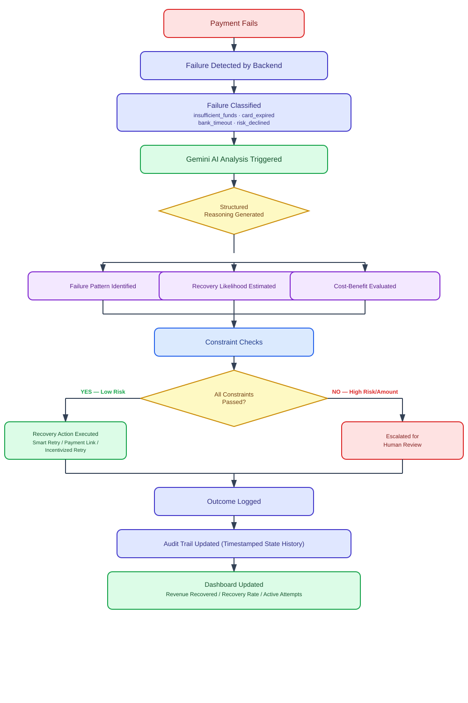
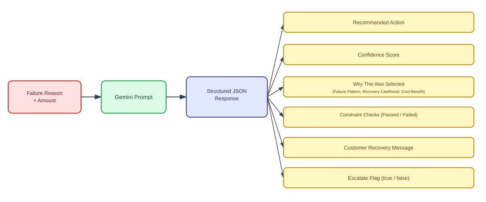
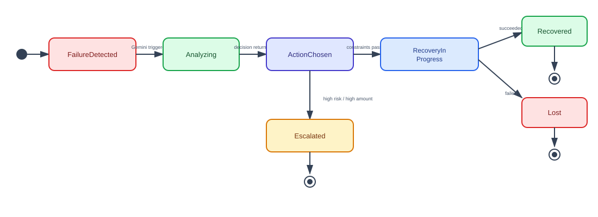

# Nabbit 🎯
### AI-Powered Payment Failure Recovery Agent

> *"Don't lose it. Nab it back."*

Nabbit is an autonomous AI agent built for the **Razorpay Buildathon 2026** (Track: AI Revenue Recovery). It detects failed payments, reasons about *why* they failed using Google Gemini, decides the smartest recovery action, and either executes it automatically or escalates it for human review — all while logging every decision through a real backend audit trail.

---

## 📌 The Problem

Online merchants silently lose revenue every day to failed payments — insufficient funds, expired cards, bank timeouts, network drops, risk declines. Most businesses either:
- Manually chase down each failure (slow, unscalable), or
- Do nothing and simply write off the loss

There is no visibility into *why* a payment failed, and no consistent, intelligent decision-making about *what to do next*.

## 💡 The Solution

Nabbit acts as an always-on recovery agent sitting between "payment failed" and "revenue lost." For every failed transaction, it:

1. Classifies the likely failure cause
2. Reasons about the best recovery strategy using an LLM (Gemini)
3. Validates that strategy against real merchant constraints (cost, risk, retry limits)
4. Either executes the recovery action or escalates it to a human — never acting blindly on high-risk cases
5. Logs the entire decision trail for auditability

---

## 🏗️ Tech Stack

| Layer | Technology |
|---|---|
| Frontend | React (Vite-based) |
| Backend | Node.js server (`server.ts`) — full-stack single-server setup |
| AI Reasoning | Google Gemini API (structured JSON output) |
| Data Persistence | Lightweight file-based / in-memory state store (JSON) |
| Dev Environment | Antigravity IDE |
| Charts | Recharts (Recovered vs Lost Revenue trend) |
| Styling | Custom dark-themed fintech dashboard UI |

---

## 🔄 System Workflow



**Flow explained:**
1. A payment fails on the merchant's side and is detected by Nabbit's backend.
2. The failure is classified into a known category (insufficient funds, card expired, bank timeout, risk declined, etc.).
3. Gemini is called with this context to generate a structured recovery analysis.
4. The reasoning is broken into three parts: the likely failure pattern, the estimated recovery likelihood, and a cost-benefit check.
5. These feed into a set of constraint checks (e.g. is the recovery cost justified, is the customer risk acceptable, are retry limits respected).
6. If all constraints pass and risk is low, Nabbit executes a recovery action automatically (Smart Retry, Payment Link, or Incentivized Retry).
7. If the amount is high or risk is flagged, the case is escalated for human review instead — no blind automation on risky cases.
8. Every outcome is logged to the audit trail with a timestamp, and the dashboard's live stats update accordingly.

---

## 🧠 AI Reasoning Structure



Rather than generating a single reasoning paragraph, Nabbit prompts Gemini to return **structured, auditable JSON** so the reasoning is transparent and inspectable — not a black box.

**Example structured output:**
```json
{
  "recommendedAction": "Smart Retry",
  "confidenceScore": 82,
  "whyThisWasSelected": {
    "failurePattern": "Likely a transient bank-side timeout, not a hard decline.",
    "recoveryLikelihood": "High — timeouts typically succeed on retry within a few hours.",
    "costBenefit": "Retry cost is negligible compared to the transaction value."
  },
  "constraintChecks": [
    { "constraint": "Recovery cost below transaction value", "status": "Passed" },
    { "constraint": "Customer risk score acceptable", "status": "Passed" },
    { "constraint": "Retry attempts within policy limit", "status": "Passed" },
    { "constraint": "Within optimal retry time window", "status": "Passed" }
  ],
  "customerMessage": "Hi! Your recent payment didn't go through — no worries, we're retrying it shortly.",
  "escalate": false
}
```

If the failure reason is high-risk (e.g. `risk_declined`) or the transaction amount exceeds a safety threshold, `escalate` is set to `true`, `recommendedAction` becomes `"Escalate for Manual Review"`, and **no automatic action or customer message is generated** — this is a deliberate safety gate, not an oversight.

---

## 🗂️ Audit Trail / State Machine



Every transaction moves through a real, persisted backend state machine — not frontend-faked status labels. Each transition is stamped with a real server-side timestamp and viewable in the **Audit Logs** tab, giving full traceability of every decision the agent made and why.

---

## 🐛 Challenges Faced & Fixes

| Challenge | Fix |
|---|---|
| Gemini occasionally wrapped JSON responses in markdown code fences (` ```json `), breaking `JSON.parse()` | Added a sanitization step to strip markdown fences before parsing the response |
| Environment variables not loading correctly on initial backend run | Verified `.env` file location and variable naming matched what the server expected; corrected the mismatch |
| Needed a way to demonstrate "real" recovery execution without a completed Razorpay merchant KYC (required for live API keys) | Built a real backend state machine with persisted, timestamped state transitions instead — demonstrates genuine backend logic and decision-tracking without depending on an external gateway integration that wasn't accessible in the hackathon window |
| Repeated "Simulate Failure" clicks during testing caused unrealistic revenue-at-risk numbers to snowball | Capped/reset simulated failure accumulation so demo numbers stay realistic |

---

## 🚧 What's Next

- **Live Razorpay integration** — the architecture is designed around Razorpay's test-mode Orders API (`create-recovery-order` endpoint scaffolded); full KYC/account setup is the remaining step
- **WhatsApp/SMS delivery** for real customer-facing recovery messages (currently generated but not dispatched)
- **Persistent database** (e.g. MongoDB) in place of the lightweight JSON/in-memory store, for production-scale transaction history
- **Merchant-configurable rules** (currently static UI) — e.g. custom risk thresholds, retry windows, discount limits

---

## 🎯 Why "Nabbit"?

The name comes from **"nab"** — to quickly catch or grab something before it's lost. Every failed payment is a brief window where revenue is about to slip away. Nabbit's agent steps in immediately to *nab it back* before it becomes a permanent loss — reflecting the app's fast, decisive, autonomous nature.

---

## 👥 Built By

- **Harkirat** — BTech student, JMIT (Yamunanagar)
- **Manish Pandey** — Chandigarh University

Built for the Razorpay Buildathon 2026, Track: AI Revenue Recovery.
